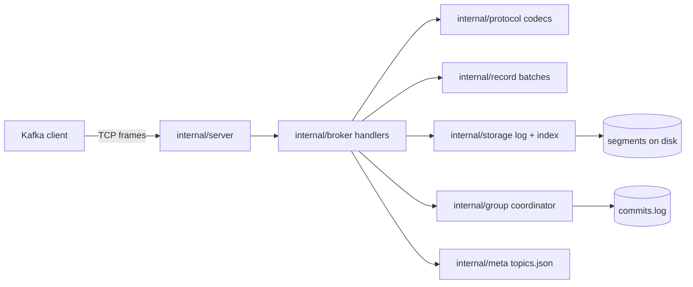

# 📨 kafka-go

> Kafka broker from scratch. Real Kafka clients produce, consume in groups and commit offsets against it.

kgod: 2228.9 MB/s produce (237% of Apache Kafka 4.3.1 on the same machine), p99 94.1 ms; 0 of 1859904 acked records lost across 40 kill -9 restarts.

<!-- readme-header -->
[](https://github.com/sathwikbairaboina2/kafka-go/actions/workflows/ci.yml)   

| Measured | Source |
|---|---|
| **2.2 GB/s produce** | `bench/results/` |
| **0 acked lost / 40 kill -9** | `bench/results/` |

The ratio is noisy. kgod's three runs ranged from 680 to 4126 MB/s, and Kafka measured 926-1034 MB/s in this run and 1557-2051 MB/s in an earlier run on the same machine (see Benchmark). Read it as "same order of magnitude", not as a precise factor.

A Kafka-compatible broker written in Go (standard library only). Real clients (kcat 1.7.1, franz-go) produce, consume in groups and commit against it.

```
$ kcat -b kafka-go-kgod:9092 -L | grep topic
  topic "bench" with 8 partitions:
  topic "compat-kcat" with 3 partitions:
  topic "demo" with 3 partitions:

$ printf 'order-1:coffee\norder-2:tea\norder-3:soda\norder-4:water\norder-5:juice\n' | kcat -b kafka-go-kgod:9092 -P -t demo -K:

$ docker kill -s KILL kafka-go-kgod        # kill -9 the broker, no clean shutdown
$ docker compose up -d kgod                # restart on the same data volume

$ kcat -b kafka-go-kgod:9092 -C -t demo -o beginning -e -f '%k=%s\n' | sort
order-1=coffee ... order-5=juice           # all 5 messages still there

$ kgoctl verify-log /data                   # checks every CRC, offset and index entry on disk
OK partitions=14 segments=14 batches=3 records=5
```

Full transcript: `docs/demo.txt`. Reproduce with `bash scripts/demo.sh`.

## What works

Exactly these API versions are implemented and checked byte for byte against franz-go's `kmsg` (ADR 0004):

| API | Key | Versions |
|---|---|---|
| Produce | 0 | 3-7 |
| Fetch | 1 | 4-11 |
| ListOffsets | 2 | 2 |
| Metadata | 3 | 4 |
| OffsetCommit | 8 | 2-7 |
| OffsetFetch | 9 | 1-7 |
| FindCoordinator | 10 | 0-2 |
| JoinGroup | 11 | 0-5 |
| Heartbeat | 12 | 0-3 |
| LeaveGroup | 13 | 0-1 |
| SyncGroup | 14 | 0-3 |
| ApiVersions | 18 | 0-3 |

Also: segmented log with sparse index and crash recovery, consumer groups, committed offsets, retention, `--fsync always|interval|never`, and `kgoctl dump-log` / `verify-log`.

## Architecture



## Limits and the tests that prove them

| # | Invariant | Test |
|---|---|---|
| 1 | Offsets are dense and increasing across segment rolls | `TestAppendOffsetsDense` |
| 2 | A corrupt batch is never appended | `TestProduceRejectsCorruptBatch`, `FuzzParseBatch` |
| 3 | An acked offset survives `kill -9` | `bench/crash` |
| 4 | Recovery truncates a torn tail | `TestRecoveryTruncatesTornWrite`, `FuzzRecoverSegment` |
| 5 | Sparse index lookup equals a linear scan | `TestIndexLookupMatchesScan` |
| 6 | Responses stay in request order | `TestPipelinedRequestsInOrder` |
| 7 | Unsupported versions never reach a decoder | `TestVersionGate` |
| 8 | Retention never deletes the active segment | `TestRetentionKeepsActiveSegment` |
| 9 | Stale-generation commits are rejected | `TestCommitStaleGenerationRejected`, `TestGroupModel` |
| 10 | An oversized frame closes the connection | `TestOversizedFrameRejected` |
| 11 | Real clients interoperate | `compat/franzgo_test.go`, `scripts/compat-kcat.sh` |
| 12 | Codecs match kmsg for every version | `*_oracle_test.go` |

## Benchmark (real run)

Produce throughput, 1 KiB records, 4 clients, 8 partitions, 3 runs of 30 s (3 s warm-up). Each row is the run with the median MB/s. Raw JSON is in `bench/results/`.

| Target | MB/s | records/s | p50 ms | p99 ms |
|---|---:|---:|---:|---:|
| kgod, fsync never | 2228.9 | 2176704 | 7.44 | 94.08 |
| kgod, fsync always | 16.8 | 16371 | 1861.72 | 9614.84 |
| Apache Kafka 4.3.1 (defaults) | 940.2 | 918200 | 25.05 | 83.49 |

```
host: 24 CPUs, 33166618624 bytes RAM, Docker Desktop, kernel 6.6.87.2-microsoft-standard-WSL2
docker: 29.5.3
date: 2026-10-04T01:06:41Z
```

Fairness: both brokers run on named volumes in the same Docker VM. Kafka uses defaults (no fsync, replication factor 1). kgod uses `--fsync never` for the headline and `--fsync always` as the durability-cost row. The load generator shares the VM. Run-to-run noise is large: kgod's three `fsync never` runs were 2229, 680 and 4126 MB/s; Kafka's three runs were 1034, 940 and 926 MB/s in this run, and 1960, 2051 and 1557 MB/s in an earlier discarded run on the same machine. Read the ratio as "same order of magnitude, kgod ahead on this setup", not as a precise factor. kgod does no replication and no fsync in the headline row.

## Crash test

`go run ./bench/crash -iterations 20 -fsync both`: 20 `kill -9` restarts per mode, 0 acked records lost (724304 acked with `always`, 1135600 with `never`), `verify-log` clean each time. This proves process-kill durability only, not power loss (ADR 0005). Recovery scans the whole active segment, so it grows with segment size.

## Quickstart

By default kgod advertises `kafka-go-kgod:9092`, which resolves only on the compose network. For a client on the host, advertise the published port. Use `127.0.0.1`, not `localhost`, so the client does not try IPv6 first.

```
KGOD_ADVERTISE=127.0.0.1:5380 docker compose up -d --build kgod
kcat -b 127.0.0.1:5380 -L
printf 'k:v\n' | kcat -b 127.0.0.1:5380 -P -t demo -K:
kcat -b 127.0.0.1:5380 -C -t demo -o beginning -e
docker compose down -v
```

If kcat is not installed on the host, run it as `docker run --rm -i --network host edenhill/kcat:1.7.1 -b 127.0.0.1:5380 ...`. The 30-second demo, `bash scripts/demo.sh`, needs only Docker.

## Run the tests

Go runs in Docker (no host install):

```
powershell -NoProfile -File scripts/go.ps1 test -race -count=1 ./...
powershell -NoProfile -File scripts/dock.ps1 sh scripts/check.sh
bash scripts/compat-kcat.sh
bash scripts/bench.sh
```

## Decisions (what I gave up)

- [0001 Verbatim batches](docs/adr/0001-verbatim-batches.md)
- [0002 Single writer per partition](docs/adr/0002-single-writer-partition.md)
- [0003 No replication in v0.1](docs/adr/0003-no-replication-in-v0.1.md)
- [0004 One version per API (amended to ranges)](docs/adr/0004-one-version-per-api.md)
- [0005 kill -9, not power loss](docs/adr/0005-kill9-not-power-loss.md)
- [0006 Docker-only toolchain and ports](docs/adr/0006-docker-only-toolchain-and-ports.md)
- [0007 Standard-library-only broker](docs/adr/0007-stdlib-only-broker.md)
- [0008 Auto-create topics, no admin API](docs/adr/0008-auto-create-no-admin-api.md)

## Status / not in v0.1

Single broker, no replication or election. No CreateTopics/DeleteTopics, transactions, idempotent producers or DescribeTopicPartitions. No fetch sessions, compaction, SASL/TLS, ACLs or quotas. No `.timeindex` (ListOffsets by timestamp is batch granular). No `/metrics` (v0.2). No zero-copy `sendfile`. No power-loss claims. No CodeCrafters stage claim.
