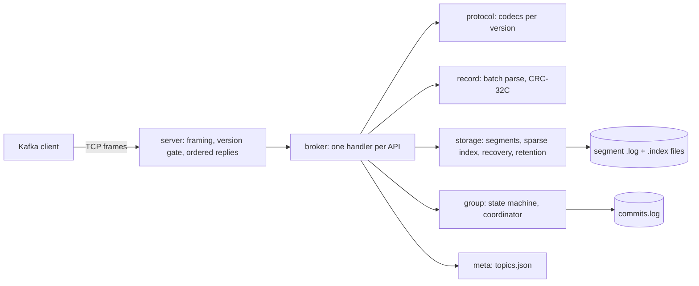

# kafka-go developer guide

## 1. What it is

kgod is a single-node Kafka broker written in Go. It uses only the standard library.
Real Kafka clients (kcat 1.7.1, franz-go) can produce to it, consume in groups and commit offsets.

Measured headline (from `go run ./bench/report` over `bench/results/`):

> kgod: 2228.9 MB/s produce (237% of Apache Kafka 4.3.1 on the same machine), p99 94.1 ms; 0 of 1859904 acked records lost across 40 kill -9 restarts.

The ratio is noisy. Kafka measured 926-1034 MB/s in the final run and 1557-2051 MB/s in an earlier run on the same machine.
Read it as "same order of magnitude". The crash number is solid: 20 `kill -9` restarts per fsync mode, with 0 acked records lost.

## 2. Quickstart (5 minutes)

You need Docker. Go and kcat are not needed on the host.

```bash
# 1. Start the broker. It advertises the host port so host clients can reach it.
KGOD_ADVERTISE=127.0.0.1:5380 docker compose up -d --build kgod

# 2. Talk to it with kcat (here kcat runs in a container on the host network).
K="docker run --rm -i --network host edenhill/kcat:1.7.1 -b 127.0.0.1:5380"
$K -L                                              # lists topics demo, compat-kcat, bench
printf 'k1:v1\nk2:v2\n' | $K -P -t demo -K:        # produce two keyed messages
$K -C -t demo -o beginning -e -f '%k=%s\n'          # read them back

# 3. Stop and delete the data volume.
docker compose down -v
```

Use `127.0.0.1`, not `localhost`. librdkafka tries `::1` first and fails.
Without `KGOD_ADVERTISE`, kgod advertises `kafka-go-kgod:9092`, which works only on the compose network.

The 30-second demo produces messages, kills the broker with `kill -9`, restarts it, reads everything back and verifies the log:

```bash
bash scripts/demo.sh        # transcript goes to docs/demo.txt
```

## 3. Architecture

A request arrives as a size-prefixed TCP frame. The server checks the API version and hands the frame to the broker.
The broker decodes it, calls storage, metadata or the group coordinator, and encodes the reply. Replies on one connection go out in request order.

Produce stores the client's record batch verbatim. Only the base offset is rewritten (ADR 0001).
Each partition has one writer at a time (ADR 0002). Fetch long-polls on a per-partition wake channel.



On startup, storage scans the active segment and truncates any torn tail. It also rebuilds a bad index.
Sealed segments are trusted.

## 4. Project layout

| Path | What it holds |
|---|---|
| `cmd/kgod` | the broker binary (flags: `--listen`, `--advertise`, `--data-dir`, `--fsync`, `--topic name:N`) |
| `cmd/kgoctl` | offline tools: `dump-log`, `verify-log` |
| `internal/server` | TCP listener, framing, version gate, in-order responses |
| `internal/broker` | API handlers: Produce, Fetch, ListOffsets, Metadata, groups, offsets |
| `internal/protocol` | wire codecs and the supported-version table |
| `internal/record` | record batch parsing and CRC checks |
| `internal/storage` | segments, sparse index, crash recovery, retention, partition manager |
| `internal/meta` | topic store with atomic replace |
| `internal/group` | consumer group state machine, coordinator, committed-offset store |
| `internal/app` | wires everything together for `kgod` |
| `compat/` | franz-go interoperability tests |
| `bench/load`, `bench/crash`, `bench/report` | load generator, kill -9 loop, report printer |
| `bench/results/` | raw JSON from the measured runs |
| `scripts/` | Docker Go wrappers (`go.ps1`, `dock.ps1`), demo, kcat compat, bench, checks |
| `docs/adr/` | architecture decision records |

## 5. Run, test, benchmark

Go runs inside the `golang:1.26` container, so the host needs no Go install. Run these from the repo root.

```powershell
powershell -NoProfile -File scripts/go.ps1 test -race -count=1 ./...     # all packages ok
powershell -NoProfile -File scripts/dock.ps1 sh scripts/check.sh         # gofmt, vet, stdlib-only
powershell -NoProfile -File scripts/go.ps1 test -run '^$' -fuzz '^FuzzParseBatch$' -fuzztime 15s ./internal/record
powershell -NoProfile -File scripts/go.ps1 test -run '^$' -fuzz '^FuzzRecoverSegment$' -fuzztime 15s ./internal/storage
powershell -NoProfile -File scripts/go.ps1 run ./bench/crash -iterations 3 -fsync both -out /tmp/crash-smoke.json
docker build -t kafka-go/kgod:dev .
```

```bash
bash scripts/compat-kcat.sh     # prints "compat-kcat: PASS"
bash scripts/bench.sh           # about 10 minutes; writes bench/results/*.json
powershell -NoProfile -File scripts/go.ps1 run ./bench/report   # prints the table and the headline
```

Ports are 5380-5389 only (kgod 5380, Kafka 5382). Every container name starts with `kafka-go-`.
The bench script starts and stops its own containers.

## 6. Key decisions and what they gave up

- [0001 Verbatim batches](adr/0001-verbatim-batches.md). Fast and simple. Gives up broker-side re-encoding and compression changes.
- [0002 Single writer per partition](adr/0002-single-writer-partition.md). No append races. Gives up parallel appends within one partition.
- [0003 No replication in v0.1](adr/0003-no-replication-in-v0.1.md). One node. A dead disk loses its data.
- [0004 Supported API versions](adr/0004-one-version-per-api.md). Started as one version per API, then widened to ranges because librdkafka needs overlap. Costs more codec branches.
- [0005 kill -9, not power loss](adr/0005-kill9-not-power-loss.md). Durability is proven for process crashes only.
- [0006 Docker-only toolchain and ports](adr/0006-docker-only-toolchain-and-ports.md). No host Go. Every command is slower to start.
- [0007 Standard-library-only broker](adr/0007-stdlib-only-broker.md). Own codecs instead of a Kafka library. franz-go, kmsg and rapid are used only in tests and bench; `scripts/check.sh` enforces this.
- [0008 Auto-create topics, no admin API](adr/0008-auto-create-no-admin-api.md). No CreateTopics or DeleteTopics.

## 7. Known limits and what is left

- Single broker. No replication, transactions, idempotent producers, fetch sessions, compaction, SASL/TLS, ACLs or quotas.
- No `.timeindex`. ListOffsets by timestamp is batch-granular.
- No `/metrics` endpoint and no zero-copy `sendfile`.
- Recovery scans the whole active segment, so restart time grows with segment size. One crash-smoke restart took 11 s.
- With `--fsync always`, throughput drops to about 17 MB/s and p99 is about 9.6 s, because there is no group commit.
- Benchmark noise between runs is large. Kafka varied about 2x across runs.
- CI (`.github/workflows/ci.yml`) has never run, because the repo has no remote.
- `FuzzRecoverSegment` is slow (file I/O), so 15 s covers only a few hundred inputs.

Next (v0.2): Prometheus metrics, `.timeindex`, CreateTopics/DeleteTopics, DescribeTopicPartitions, group commit for `--fsync always`, faster recovery.
