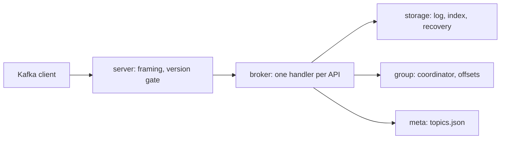

# kafka-go developer guide

## 1. What it is

kgod is a Kafka-compatible broker in Go, standard library only. Headline (measured, see `bench/results/`):

kgod: 2228.9 MB/s produce (237% of Apache Kafka 4.3.1 on the same machine), p99 94.1 ms; 0 of 1859904 acked records lost across 40 kill -9 restarts.

## 2. Quickstart (5 minutes)

```
docker compose up -d --build kgod
kcat -b localhost:5380 -L
printf 'k:v\n' | kcat -b localhost:5380 -P -t demo -K:
kcat -b localhost:5380 -C -t demo -o beginning -e
docker compose down -v
```

## 3. Architecture



A request is read as a size-prefixed frame, version-checked, decoded, handled, and answered in order. Produce appends the client's batch verbatim. Only the base offset is rewritten.

## 4. Project layout

| Path | What it holds |
|---|---|
| `internal/protocol` | wire codecs and version table |
| `internal/record` | record batch parse, CRC-32C |
| `internal/storage` | segments, sparse index, recovery, retention |
| `internal/meta` | topic store |
| `internal/group` | group state machine, coordinator, offset store |
| `internal/broker` | API handlers |
| `internal/server` | TCP listener and framing |
| `cmd/kgod`, `cmd/kgoctl` | broker and offline log tools |
| `compat/` | franz-go interoperability tests |
| `bench/` | load generator, crash loop, report |
| `scripts/` | Docker Go wrappers, demo, kcat compat, bench |

## 5. Run, test, benchmark

```
powershell -NoProfile -File scripts/go.ps1 test -race -count=1 ./...
powershell -NoProfile -File scripts/dock.ps1 sh scripts/check.sh
bash scripts/compat-kcat.sh
bash scripts/demo.sh
bash scripts/bench.sh
powershell -NoProfile -File scripts/go.ps1 run ./bench/crash -iterations 20 -fsync both
```

Ports 5380-5389 only. Containers are named `kafka-go-*`.

## 6. Key decisions

- [0001 Verbatim batches](adr/0001-verbatim-batches.md): fast and simple, gives up broker-side re-encoding.
- [0002 Single writer per partition](adr/0002-single-writer-partition.md): no append races, but limits per-partition parallelism.
- [0003 No replication](adr/0003-no-replication-in-v0.1.md): a single node loses data if its disk dies.
- [0004 Versions](adr/0004-one-version-per-api.md): ranges per API, more codec branches.
- [0005 kill -9 not power loss](adr/0005-kill9-not-power-loss.md): process-crash durability only.
- [0006 Docker toolchain](adr/0006-docker-only-toolchain-and-ports.md): no host Go.
- [0007 Stdlib-only broker](adr/0007-stdlib-only-broker.md): own codecs instead of a library.
- [0008 Auto-create topics](adr/0008-auto-create-no-admin-api.md): no CreateTopics API.

## 7. Known limits and what is left

Not in v0.1: replication, transactions, idempotent producers, fetch sessions, compaction, SASL/TLS, `.timeindex`, `/metrics`, zero-copy fetch, power-loss durability. Recovery time grows with the active segment size. Benchmark noise between runs is large (see README).

Next (v0.2): Prometheus metrics, `.timeindex`, CreateTopics/DeleteTopics, DescribeTopicPartitions.
